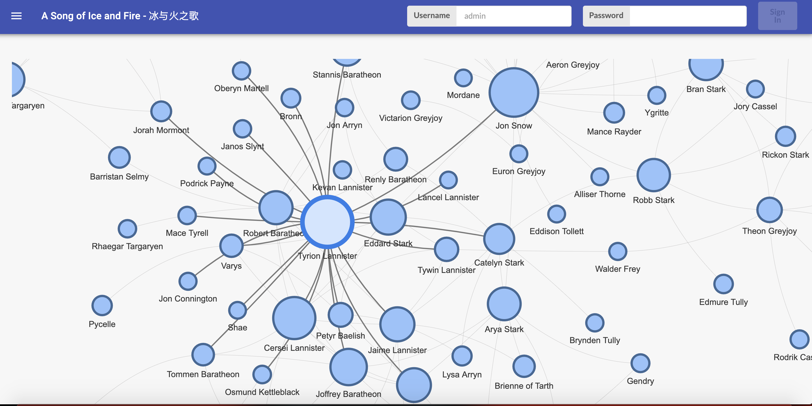
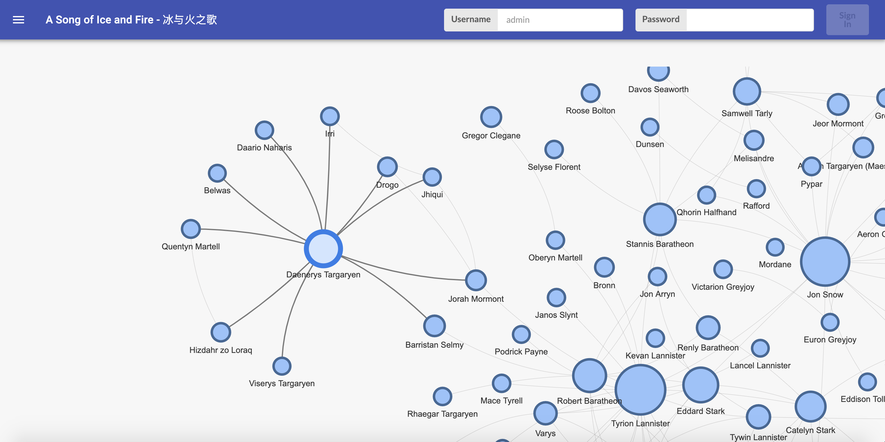
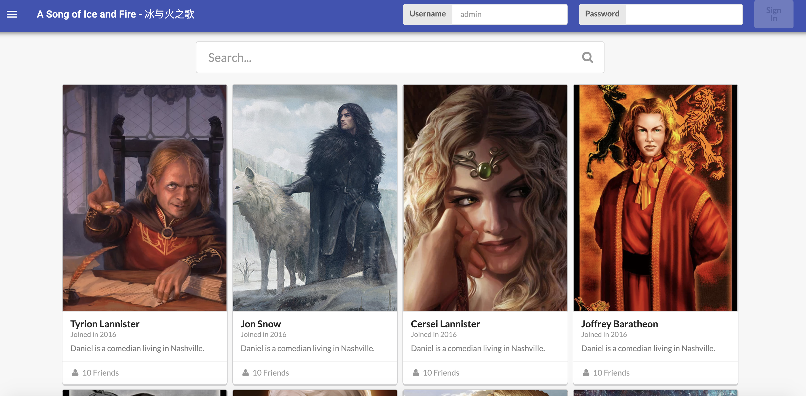

## Character database & Network visualization of the song of Ice and Fire

### Current version(alpha): deleveloped in May, 2019. Will continue developing in Fall 2019 and Spring 2020.

### File detail:
 - `Frontend`: React.js + Material UI + Semantic UI
 - `Backend`: Express.js(server requests and routing) + MongoDB
 - Data: 
    - Raw data from [Here](https://github.com/mathbeveridge/asoiaf), and the data are processed in `got_r_analysis`
    - Character's images are scraped from [asoiafWiki](https://awoiaf.westeros.org/index.php/Main_Page), source code in `scrapers`
    - Character-specific data are from the API of the song of ice and fire

### Sample screenshot:

#### Main page (network visualization of characters' interactions)

The following images are networks of Tyrion and Daenerys's

 

#### Character's search page

